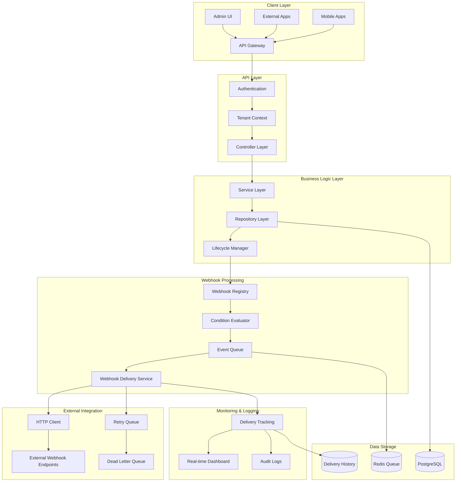
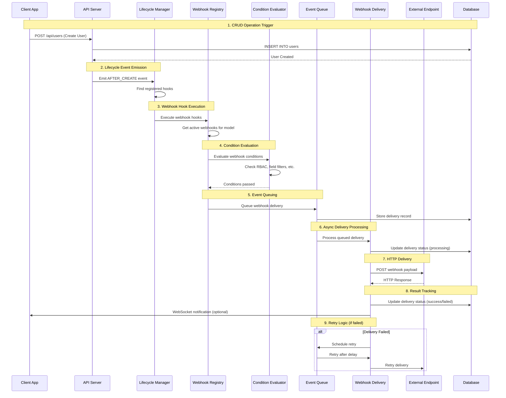
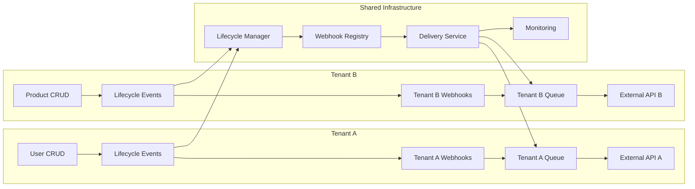
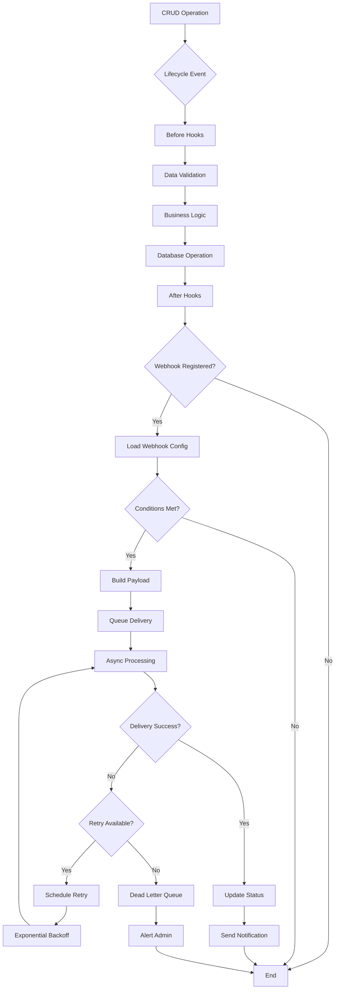

# Strapi-Style Webhook Feature Implementation Blueprint

## Overview

This blueprint provides a comprehensive guide for implementing Strapi-style webhooks as a core feature in AegisX Platform. The implementation includes lifecycle hooks, admin UI management, and enterprise-grade webhook delivery with multi-tenancy support.

## Data Flow Architecture

### High-Level Data Flow



### Detailed Webhook Flow



### Multi-Tenant Data Isolation Flow



### Event Processing Pipeline



## Feature Scope

### Core Capabilities
- **Lifecycle-driven Webhooks**: Auto-trigger on CRUD operations
- **Admin UI Management**: Web-based webhook configuration
- **Multi-tenant Isolation**: Webhook isolation per tenant
- **Advanced Retry Logic**: Exponential backoff with dead letter queues
- **Real-time Monitoring**: WebSocket-based delivery status
- **Conditional Triggers**: RBAC and business rule integration
- **Event Filtering**: Granular event selection and transformation

### Target Use Cases
- **HIS Integration**: Lab systems, imaging, billing
- **ERP Integration**: Accounting, inventory, CRM
- **Partner APIs**: Real-time data synchronization
- **Compliance**: Audit trail and regulatory reporting

## Data Flow Patterns

### 1. Synchronous Flow (Real-time)
```
Client Request → API → Business Logic → Database → Lifecycle Event → Webhook Trigger → Queue
```

### 2. Asynchronous Processing Flow
```
Queue → Delivery Service → HTTP Client → External Endpoint → Response Handler → Status Update
```

### 3. Retry Flow
```
Failed Delivery → Retry Queue → Exponential Backoff → Retry Attempt → Success/Dead Letter
```

### 4. Monitoring Flow
```
Delivery Attempt → Status Update → Real-time Dashboard → WebSocket Notification → Admin UI
```

## Data Flow Examples

### Example 1: User Creation Webhook Flow

```typescript
// 1. Client creates user
const response = await fetch('/api/users', {
  method: 'POST',
  body: JSON.stringify({
    name: 'John Doe',
    email: 'john@example.com',
    role: 'user'
  })
});

// 2. API processes request
class UserController {
  async create(data: CreateUserDto, context: RequestContext) {
    // Repository triggers lifecycle events
    const user = await this.userRepository.create(data, {
      tenantId: context.tenantId,
      userId: context.userId,
      source: 'api'
    });
    
    return user;
  }
}

// 3. Repository emits lifecycle event
class UserRepository extends LifecycleAwareRepository<User> {
  async create(data: Partial<User>, context: LifecycleContext) {
    // Before hooks
    await this.executeHooks(LifecycleEvent.BEFORE_CREATE, data, context);
    
    // Database operation
    const user = await super.create(data);
    
    // After hooks (webhook triggers here)
    await this.executeHooks(LifecycleEvent.AFTER_CREATE, user, context);
    
    return user;
  }
}

// 4. Webhook Registry processes event
class WebhookRegistryService {
  async handleLifecycleEvent(eventData: LifecycleEventData) {
    const webhooks = await this.getActiveWebhooks(
      eventData.context.tenantId,
      eventData.model,
      eventData.event
    );
    
    for (const webhook of webhooks) {
      if (await this.evaluateConditions(webhook, eventData)) {
        await this.queueDelivery(webhook, eventData);
      }
    }
  }
}

// 5. Delivery Service processes queue
class WebhookDeliveryService {
  async processDelivery(delivery: WebhookDelivery) {
    const payload = this.buildPayload(delivery);
    
    try {
      const response = await this.httpClient.post(delivery.webhook.url, payload, {
        headers: {
          'Content-Type': 'application/json',
          'X-Webhook-Signature-256': this.generateSignature(payload, delivery.webhook.secret)
        }
      });
      
      await this.markDeliverySuccess(delivery.id, response);
    } catch (error) {
      await this.handleDeliveryFailure(delivery, error);
    }
  }
}
```

### Example 2: Conditional Webhook Trigger

```typescript
// Webhook configuration with conditions
const webhookConfig = {
  name: 'High-Value Order Notification',
  url: 'https://external-system.com/webhooks/orders',
  triggers: {
    order: {
      create: true,
      update: true
    }
  },
  conditions: {
    and: [
      {
        type: 'field',
        field: 'total_amount',
        operator: 'gt',
        value: 10000
      },
      {
        type: 'field',
        field: 'status',
        operator: 'in',
        value: ['confirmed', 'paid']
      },
      {
        type: 'role',
        operator: 'not_in',
        value: ['test_user', 'demo_user']
      }
    ]
  }
};

// Condition evaluation flow
class WebhookConditionService {
  async evaluateConditions(
    conditions: WebhookCondition[],
    eventData: LifecycleEventData
  ): Promise<boolean> {
    if (!conditions || conditions.length === 0) return true;
    
    for (const condition of conditions) {
      const result = await this.evaluateCondition(condition, eventData);
      if (!result) return false;
    }
    
    return true;
  }
  
  private async evaluateCondition(
    condition: WebhookCondition,
    eventData: LifecycleEventData
  ): Promise<boolean> {
    switch (condition.type) {
      case 'field':
        return this.evaluateFieldCondition(condition, eventData.data);
      case 'role':
        return this.evaluateRoleCondition(condition, eventData.context);
      case 'tenant':
        return this.evaluateTenantCondition(condition, eventData.context);
      case 'custom':
        return condition.customValidator(eventData.data, eventData.context);
      default:
        return true;
    }
  }
}
```

## Payload Structure Examples

### Standard Webhook Payload

```json
{
  "event": "user.created",
  "created_at": "2024-01-15T10:30:00Z",
  "data": {
    "id": "123e4567-e89b-12d3-a456-426614174000",
    "name": "John Doe",
    "email": "john@example.com",
    "role": "user",
    "created_at": "2024-01-15T10:30:00Z",
    "updated_at": "2024-01-15T10:30:00Z"
  },
  "previous_data": null,
  "context": {
    "tenant_id": "tenant-123",
    "user_id": "admin-456",
    "user_role": "admin",
    "request_id": "req-789",
    "source": "api"
  },
  "webhook": {
    "id": "webhook-abc",
    "name": "User Management Webhook",
    "delivery_id": "delivery-xyz"
  }
}
```

### Update Event Payload

```json
{
  "event": "order.updated",
  "created_at": "2024-01-15T10:35:00Z",
  "data": {
    "id": "order-123",
    "status": "shipped",
    "total_amount": 15000,
    "updated_at": "2024-01-15T10:35:00Z"
  },
  "previous_data": {
    "status": "confirmed",
    "updated_at": "2024-01-15T09:00:00Z"
  },
  "changes": {
    "status": {
      "from": "confirmed",
      "to": "shipped"
    }
  },
  "context": {
    "tenant_id": "tenant-456",
    "user_id": "staff-789",
    "user_role": "staff",
    "request_id": "req-abc",
    "source": "admin"
  }
}
```

### Batch Operation Payload

```json
{
  "event": "products.bulk_updated",
  "created_at": "2024-01-15T10:40:00Z",
  "data": {
    "operation": "bulk_update",
    "affected_count": 25,
    "filter": {
      "category": "electronics",
      "status": "active"
    },
    "updates": {
      "discount_percentage": 10
    }
  },
  "context": {
    "tenant_id": "tenant-789",
    "user_id": "manager-123",
    "user_role": "manager",
    "request_id": "req-def",
    "source": "admin"
  }
}
```

## Error Handling & Retry Flow

### Retry Configuration

```typescript
interface RetryPolicy {
  max_attempts: number;
  backoff_strategy: 'linear' | 'exponential' | 'fixed';
  initial_delay: number; // milliseconds
  max_delay: number;
  jitter: boolean;
  retry_on_status: number[]; // HTTP status codes to retry
}

// Example retry policy
const defaultRetryPolicy: RetryPolicy = {
  max_attempts: 3,
  backoff_strategy: 'exponential',
  initial_delay: 1000,
  max_delay: 60000,
  jitter: true,
  retry_on_status: [408, 429, 500, 502, 503, 504]
};
```

### Retry Flow Implementation

```typescript
class WebhookRetryService {
  async scheduleRetry(delivery: WebhookDelivery, error: any): Promise<void> {
    const nextAttempt = delivery.attempt_count + 1;
    
    if (nextAttempt > delivery.max_attempts) {
      await this.moveToDeadLetterQueue(delivery, error);
      return;
    }
    
    const delay = this.calculateDelay(
      delivery.webhook.retry_policy,
      nextAttempt
    );
    
    await this.updateDeliveryForRetry(delivery.id, {
      status: 'retrying',
      next_attempt_at: new Date(Date.now() + delay),
      error_message: error.message
    });
    
    // Schedule retry job
    await this.queueService.schedule(
      'webhook-retry',
      { deliveryId: delivery.id },
      delay
    );
  }
  
  private calculateDelay(policy: RetryPolicy, attempt: number): number {
    let delay: number;
    
    switch (policy.backoff_strategy) {
      case 'exponential':
        delay = policy.initial_delay * Math.pow(2, attempt - 1);
        break;
      case 'linear':
        delay = policy.initial_delay * attempt;
        break;
      case 'fixed':
        delay = policy.initial_delay;
        break;
    }
    
    delay = Math.min(delay, policy.max_delay);
    
    if (policy.jitter) {
      delay += Math.random() * 1000; // Add up to 1 second jitter
    }
    
    return delay;
  }
}
```

## Monitoring & Analytics

### Real-time Dashboard Metrics

```typescript
interface WebhookMetrics {
  total_deliveries: number;
  successful_deliveries: number;
  failed_deliveries: number;
  retry_deliveries: number;
  average_response_time: number;
  success_rate: number;
  endpoints_status: {
    [endpointId: string]: {
      status: 'healthy' | 'degraded' | 'down';
      last_success: Date;
      consecutive_failures: number;
    };
  };
}

// Real-time metrics collection
class WebhookMetricsService {
  async collectMetrics(tenantId: string, timeRange: string): Promise<WebhookMetrics> {
    const deliveries = await this.getDeliveries(tenantId, timeRange);
    
    return {
      total_deliveries: deliveries.length,
      successful_deliveries: deliveries.filter(d => d.status === 'success').length,
      failed_deliveries: deliveries.filter(d => d.status === 'failed').length,
      retry_deliveries: deliveries.filter(d => d.attempt_count > 1).length,
      average_response_time: this.calculateAverageResponseTime(deliveries),
      success_rate: this.calculateSuccessRate(deliveries),
      endpoints_status: await this.getEndpointsStatus(tenantId)
    };
  }
}
```

## Implementation Phases

### Phase 1: Core Infrastructure (Week 1-2)

#### 1.1 Lifecycle Management System

```bash
# File structure
libs/core/lifecycle/
├── interfaces/
│   ├── lifecycle-event.interface.ts
│   ├── lifecycle-context.interface.ts
│   └── lifecycle-hook.interface.ts
├── managers/
│   ├── lifecycle-manager.ts
│   └── hook-registry.ts
├── decorators/
│   ├── lifecycle-hook.decorator.ts
│   └── webhook-trigger.decorator.ts
└── index.ts
```

**Key Files:**

```typescript
// libs/core/lifecycle/interfaces/lifecycle-event.interface.ts
export enum LifecycleEvent {
  BEFORE_CREATE = 'before:create',
  AFTER_CREATE = 'after:create',
  BEFORE_UPDATE = 'before:update', 
  AFTER_UPDATE = 'after:update',
  BEFORE_DELETE = 'before:delete',
  AFTER_DELETE = 'after:delete',
  BEFORE_FIND = 'before:find',
  AFTER_FIND = 'after:find',
  BEFORE_PUBLISH = 'before:publish',
  AFTER_PUBLISH = 'after:publish'
}

export interface LifecycleEventData {
  event: LifecycleEvent;
  model: string;
  data: any;
  previous?: any; // For update operations
  context: LifecycleContext;
}

export interface LifecycleContext {
  tenantId: string;
  userId?: string;
  userRole?: string;
  requestId: string;
  timestamp: Date;
  source: 'api' | 'admin' | 'system' | 'migration';
  metadata?: Record<string, any>;
}

// libs/core/lifecycle/interfaces/lifecycle-hook.interface.ts
export interface LifecycleHook {
  id: string;
  event: LifecycleEvent;
  model: string;
  priority: number; // Lower = higher priority
  conditions?: LifecycleCondition[];
  handler: LifecycleHandler;
}

export interface LifecycleCondition {
  type: 'role' | 'field' | 'tenant' | 'custom';
  operator: 'equals' | 'not_equals' | 'in' | 'not_in' | 'gt' | 'lt' | 'contains';
  field?: string;
  value: any;
  customValidator?: (data: any, context: LifecycleContext) => boolean;
}

export type LifecycleHandler = (
  data: LifecycleEventData
) => Promise<void | LifecycleEventData>;
```

#### 1.2 Enhanced Repository Base Class

```typescript
// libs/core/database/lifecycle-aware-repository.ts
export abstract class LifecycleAwareRepository<T> extends BaseTenantRepository<T> {
  constructor(
    protected db: TenantQueryBuilder,
    protected tableName: string,
    protected lifecycleManager: LifecycleManager
  ) {
    super(db, tableName);
  }

  async create(data: Partial<T>, context?: Partial<LifecycleContext>): Promise<T> {
    const fullContext = this.buildContext(context);
    
    // Before hooks
    const beforeData = await this.executeHooks(
      LifecycleEvent.BEFORE_CREATE,
      data,
      fullContext
    );

    // Actual operation
    const created = await super.create(beforeData);

    // After hooks
    await this.executeHooks(
      LifecycleEvent.AFTER_CREATE,
      created,
      fullContext
    );

    return created;
  }

  async update(id: string, data: Partial<T>, context?: Partial<LifecycleContext>): Promise<T | null> {
    const fullContext = this.buildContext(context);
    const existing = await this.findById(id);

    if (!existing) return null;

    // Before hooks
    const beforeData = await this.executeHooks(
      LifecycleEvent.BEFORE_UPDATE,
      { id, data, existing },
      fullContext
    );

    // Actual operation
    const updated = await super.update(id, beforeData.data);

    if (updated) {
      // After hooks
      await this.executeHooks(
        LifecycleEvent.AFTER_UPDATE,
        { id, data: updated, previous: existing },
        fullContext
      );
    }

    return updated;
  }

  private async executeHooks(
    event: LifecycleEvent,
    data: any,
    context: LifecycleContext
  ): Promise<any> {
    return this.lifecycleManager.executeHooks({
      event,
      model: this.tableName,
      data,
      context
    });
  }

  private buildContext(partial?: Partial<LifecycleContext>): LifecycleContext {
    return {
      tenantId: this.db.tenantId,
      userId: this.getCurrentUserId(),
      userRole: this.getCurrentUserRole(),
      requestId: this.getRequestId(),
      timestamp: new Date(),
      source: 'api',
      ...partial
    };
  }

  protected abstract getCurrentUserId(): string | undefined;
  protected abstract getCurrentUserRole(): string | undefined;
  protected abstract getRequestId(): string;
}
```

#### 1.3 Webhook Configuration Schema

```sql
-- Phase 1 Database Schema
-- libs/core/database/migrations/001_create_webhook_tables.sql

-- Webhook endpoints with Strapi-style configuration
CREATE TABLE webhook_endpoints (
  id UUID PRIMARY KEY DEFAULT gen_random_uuid(),
  tenant_id UUID NOT NULL REFERENCES tenants(id),
  name VARCHAR(255) NOT NULL,
  description TEXT,
  url TEXT NOT NULL,
  method VARCHAR(10) DEFAULT 'POST',
  headers JSONB DEFAULT '{}',
  enabled BOOLEAN DEFAULT true,
  
  -- Strapi-style event configuration
  triggers JSONB NOT NULL DEFAULT '{}', -- { "user": { "create": true, "update": false } }
  conditions JSONB DEFAULT '{}', -- Advanced filtering conditions
  
  -- Delivery configuration
  retry_policy JSONB NOT NULL DEFAULT '{
    "max_attempts": 3,
    "backoff_strategy": "exponential",
    "initial_delay": 1000,
    "max_delay": 60000,
    "jitter": true
  }',
  
  -- Security
  secret VARCHAR(255) NOT NULL,
  signature_header VARCHAR(100) DEFAULT 'X-Webhook-Signature-256',
  
  -- Metadata
  created_by UUID REFERENCES users(id),
  created_at TIMESTAMP DEFAULT NOW(),
  updated_at TIMESTAMP DEFAULT NOW(),
  last_triggered_at TIMESTAMP,
  
  CONSTRAINT unique_webhook_name_per_tenant UNIQUE(tenant_id, name)
);

-- Webhook deliveries tracking
CREATE TABLE webhook_deliveries (
  id UUID PRIMARY KEY DEFAULT gen_random_uuid(),
  webhook_endpoint_id UUID NOT NULL REFERENCES webhook_endpoints(id) ON DELETE CASCADE,
  
  -- Event information
  event_type VARCHAR(255) NOT NULL,
  event_id UUID,
  model_name VARCHAR(100) NOT NULL,
  
  -- Delivery details
  payload JSONB NOT NULL,
  status VARCHAR(50) NOT NULL DEFAULT 'pending', -- pending, success, failed, retrying, cancelled
  attempt_count INTEGER DEFAULT 0,
  max_attempts INTEGER NOT NULL,
  
  -- Timing
  created_at TIMESTAMP DEFAULT NOW(),
  first_attempt_at TIMESTAMP,
  last_attempt_at TIMESTAMP,
  next_attempt_at TIMESTAMP,
  completed_at TIMESTAMP,
  
  -- Response details
  response_status INTEGER,
  response_headers JSONB,
  response_body TEXT,
  response_time_ms INTEGER,
  
  -- Error tracking
  error_message TEXT,
  error_code VARCHAR(50),
  
  -- Metadata
  tenant_id UUID NOT NULL REFERENCES tenants(id),
  triggered_by UUID REFERENCES users(id)
);

-- Webhook event templates (for UI)
CREATE TABLE webhook_event_templates (
  id UUID PRIMARY KEY DEFAULT gen_random_uuid(),
  model_name VARCHAR(100) NOT NULL,
  event_type VARCHAR(100) NOT NULL,
  display_name VARCHAR(255) NOT NULL,
  description TEXT,
  payload_schema JSONB,
  is_system BOOLEAN DEFAULT false,
  created_at TIMESTAMP DEFAULT NOW(),
  
  CONSTRAINT unique_model_event UNIQUE(model_name, event_type)
);

-- Indexes for performance
CREATE INDEX idx_webhook_endpoints_tenant_enabled ON webhook_endpoints(tenant_id, enabled);
CREATE INDEX idx_webhook_deliveries_status ON webhook_deliveries(status);
CREATE INDEX idx_webhook_deliveries_next_attempt ON webhook_deliveries(next_attempt_at) WHERE status = 'retrying';
CREATE INDEX idx_webhook_deliveries_webhook_created ON webhook_deliveries(webhook_endpoint_id, created_at);
```

### Phase 2: Webhook Service Layer (Week 3)

#### 2.1 Core Webhook Services

```bash
# File structure
libs/modules/webhook/
├── services/
│   ├── webhook-registry.service.ts
│   ├── webhook-delivery.service.ts
│   ├── webhook-lifecycle.service.ts
│   └── webhook-condition.service.ts
├── interfaces/
│   ├── webhook-config.interface.ts
│   └── webhook-delivery.interface.ts
├── decorators/
│   ├── webhook-event.decorator.ts
│   └── webhook-model.decorator.ts
└── index.ts
```

**Key Implementation:**

```typescript
// libs/modules/webhook/services/webhook-registry.service.ts
@Injectable()
export class WebhookRegistryService {
  constructor(
    private db: TenantQueryBuilder,
    private lifecycleManager: LifecycleManager,
    private conditionService: WebhookConditionService,
    private redis: Redis
  ) {}

  async registerWebhook(config: CreateWebhookConfig): Promise<WebhookEndpoint> {
    // Validate configuration
    await this.validateWebhookConfig(config);

    // Create webhook endpoint
    const webhook = await this.createWebhookEndpoint(config);

    // Register lifecycle hooks
    await this.registerLifecycleHooks(webhook);

    // Clear cache
    await this.clearWebhookCache(config.tenantId);

    return webhook;
  }

  async updateWebhook(id: string, updates: UpdateWebhookConfig): Promise<WebhookEndpoint> {
    const existing = await this.findWebhookById(id);
    if (!existing) throw new Error('Webhook not found');

    // Unregister old hooks
    await this.unregisterLifecycleHooks(existing);

    // Update webhook
    const updated = await this.updateWebhookEndpoint(id, updates);

    // Register new hooks
    await this.registerLifecycleHooks(updated);

    await this.clearWebhookCache(updated.tenantId);
    return updated;
  }

  private async registerLifecycleHooks(webhook: WebhookEndpoint): Promise<void> {
    const triggers = webhook.triggers as Record<string, Record<string, boolean>>;

    for (const [modelName, events] of Object.entries(triggers)) {
      for (const [eventType, enabled] of Object.entries(events)) {
        if (!enabled) continue;

        const lifecycleEvent = this.mapToLifecycleEvent(eventType);
        
        await this.lifecycleManager.registerHook({
          id: `webhook-${webhook.id}-${modelName}-${eventType}`,
          event: lifecycleEvent,
          model: modelName,
          priority: 100, // Lower priority than business logic hooks
          conditions: this.buildConditions(webhook.conditions),
          handler: async (eventData: LifecycleEventData) => {
            await this.triggerWebhook(webhook, eventData);
          }
        });
      }
    }
  }

  private async triggerWebhook(
    webhook: WebhookEndpoint, 
    eventData: LifecycleEventData
  ): Promise<void> {
    // Check if webhook should trigger based on conditions
    const shouldTrigger = await this.conditionService.evaluateConditions(
      webhook.conditions,
      eventData
    );

    if (!shouldTrigger) {
      console.log(`Webhook ${webhook.id} conditions not met for ${eventData.event}`);
      return;
    }

    // Build payload
    const payload = await this.buildWebhookPayload(webhook, eventData);

    // Queue delivery
    await this.deliveryService.queueDelivery({
      webhookId: webhook.id,
      eventData,
      payload,
      tenantId: eventData.context.tenantId
    });
  }

  private async buildWebhookPayload(
    webhook: WebhookEndpoint,
    eventData: LifecycleEventData
  ): Promise<any> {
    const [, eventType] = eventData.event.split(':');
    
    return {
      id: uuidv4(),
      event: `${eventData.model}.${eventType}`,
      createdAt: eventData.context.timestamp.toISOString(),
      model: eventData.model,
      entry: eventData.data, // Strapi-style naming
      meta: {
        tenantId: eventData.context.tenantId,
        userId: eventData.context.userId,
        requestId: eventData.context.requestId
      },
      webhook: {
        id: webhook.id,
        name: webhook.name
      }
    };
  }
}
```

#### 2.2 Advanced Condition Engine

```typescript
// libs/modules/webhook/services/webhook-condition.service.ts
@Injectable()
export class WebhookConditionService {
  async evaluateConditions(
    conditions: WebhookCondition[],
    eventData: LifecycleEventData
  ): Promise<boolean> {
    if (!conditions || conditions.length === 0) return true;

    // All conditions must pass (AND logic)
    for (const condition of conditions) {
      const result = await this.evaluateCondition(condition, eventData);
      if (!result) return false;
    }

    return true;
  }

  private async evaluateCondition(
    condition: WebhookCondition,
    eventData: LifecycleEventData
  ): Promise<boolean> {
    switch (condition.type) {
      case 'role':
        return this.evaluateRoleCondition(condition, eventData.context);
      
      case 'field':
        return this.evaluateFieldCondition(condition, eventData.data);
      
      case 'tenant':
        return this.evaluateTenantCondition(condition, eventData.context);
      
      case 'time':
        return this.evaluateTimeCondition(condition, eventData.context);
      
      case 'custom':
        return this.evaluateCustomCondition(condition, eventData);
      
      default:
        console.warn(`Unknown condition type: ${condition.type}`);
        return true;
    }
  }

  private evaluateRoleCondition(
    condition: WebhookCondition,
    context: LifecycleContext
  ): boolean {
    if (!context.userRole) return false;

    switch (condition.operator) {
      case 'equals':
        return context.userRole === condition.value;
      case 'in':
        return Array.isArray(condition.value) && condition.value.includes(context.userRole);
      case 'not_in':
        return Array.isArray(condition.value) && !condition.value.includes(context.userRole);
      default:
        return false;
    }
  }

  private evaluateFieldCondition(
    condition: WebhookCondition,
    data: any
  ): boolean {
    if (!condition.field) return false;

    const fieldValue = this.getNestedValue(data, condition.field);

    switch (condition.operator) {
      case 'equals':
        return fieldValue === condition.value;
      case 'not_equals':
        return fieldValue !== condition.value;
      case 'in':
        return Array.isArray(condition.value) && condition.value.includes(fieldValue);
      case 'gt':
        return typeof fieldValue === 'number' && fieldValue > condition.value;
      case 'lt':
        return typeof fieldValue === 'number' && fieldValue < condition.value;
      case 'contains':
        return typeof fieldValue === 'string' && fieldValue.includes(condition.value);
      default:
        return false;
    }
  }

  private getNestedValue(obj: any, path: string): any {
    return path.split('.').reduce((current, key) => current?.[key], obj);
  }
}
```

### Phase 3: Admin API Layer (Week 4)

#### 3.1 REST API Endpoints

```typescript
// apps/api/src/routes/admin/webhooks.ts
export async function adminWebhookRoutes(fastify: FastifyInstance) {
  const webhookRegistry = fastify.webhookRegistry;
  const webhookDelivery = fastify.webhookDelivery;

  // List webhooks with pagination and filtering
  fastify.get('/admin/webhooks', {
    preHandler: [fastify.authenticate, fastify.requirePermission('webhook:read')],
    schema: {
      querystring: {
        type: 'object',
        properties: {
          page: { type: 'integer', minimum: 1, default: 1 },
          limit: { type: 'integer', minimum: 1, maximum: 100, default: 20 },
          search: { type: 'string' },
          enabled: { type: 'boolean' },
          model: { type: 'string' }
        }
      }
    }
  }, async (request, reply) => {
    const { page, limit, search, enabled, model } = request.query;
    
    const result = await webhookRegistry.listWebhooks(request.tenant.id, {
      page,
      limit,
      search,
      enabled,
      model
    });

    return {
      data: result.data,
      meta: {
        pagination: {
          page,
          limit,
          total: result.total,
          pageCount: Math.ceil(result.total / limit)
        }
      }
    };
  });

  // Create webhook
  fastify.post('/admin/webhooks', {
    preHandler: [fastify.authenticate, fastify.requirePermission('webhook:create')],
    schema: {
      body: {
        type: 'object',
        required: ['name', 'url', 'triggers'],
        properties: {
          name: { type: 'string', minLength: 1, maxLength: 255 },
          description: { type: 'string', maxLength: 1000 },
          url: { type: 'string', format: 'uri' },
          method: { type: 'string', enum: ['POST', 'PUT', 'PATCH'], default: 'POST' },
          headers: { type: 'object' },
          enabled: { type: 'boolean', default: true },
          triggers: {
            type: 'object',
            patternProperties: {
              '^[a-zA-Z_][a-zA-Z0-9_]*$': {
                type: 'object',
                properties: {
                  create: { type: 'boolean' },
                  update: { type: 'boolean' },
                  delete: { type: 'boolean' },
                  publish: { type: 'boolean' },
                  unpublish: { type: 'boolean' }
                }
              }
            }
          },
          conditions: {
            type: 'array',
            items: {
              type: 'object',
              required: ['type', 'operator', 'value'],
              properties: {
                type: { type: 'string', enum: ['role', 'field', 'tenant', 'time', 'custom'] },
                operator: { type: 'string', enum: ['equals', 'not_equals', 'in', 'not_in', 'gt', 'lt', 'contains'] },
                field: { type: 'string' },
                value: {} // Can be any type
              }
            }
          },
          retryPolicy: {
            type: 'object',
            properties: {
              maxAttempts: { type: 'integer', minimum: 1, maximum: 10, default: 3 },
              backoffStrategy: { type: 'string', enum: ['linear', 'exponential'], default: 'exponential' },
              initialDelay: { type: 'integer', minimum: 100, default: 1000 },
              maxDelay: { type: 'integer', minimum: 1000, default: 60000 },
              jitter: { type: 'boolean', default: true }
            }
          }
        }
      }
    }
  }, async (request, reply) => {
    const webhook = await webhookRegistry.createWebhook(request.tenant.id, {
      ...request.body,
      createdBy: request.user.id
    });

    // Send webhook created event
    await fastify.eventBus.publish({
      type: 'webhook.created',
      tenantId: request.tenant.id,
      data: { webhook },
      userId: request.user.id
    });

    return { data: webhook };
  });

  // Test webhook
  fastify.post('/admin/webhooks/:id/test', {
    preHandler: [fastify.authenticate, fastify.requirePermission('webhook:test')]
  }, async (request, reply) => {
    const { id } = request.params;
    
    const result = await webhookRegistry.testWebhook(id, {
      testPayload: {
        event: 'webhook.test',
        createdAt: new Date().toISOString(),
        model: 'test',
        entry: {
          id: 'test-123',
          message: 'This is a test webhook delivery',
          timestamp: new Date().toISOString()
        },
        meta: {
          tenantId: request.tenant.id,
          userId: request.user.id,
          test: true
        }
      }
    });

    return { data: result };
  });

  // Get webhook analytics
  fastify.get('/admin/webhooks/:id/analytics', {
    preHandler: [fastify.authenticate, fastify.requirePermission('webhook:read')]
  }, async (request, reply) => {
    const { id } = request.params;
    const { period = '7d' } = request.query;

    const analytics = await webhookDelivery.getWebhookAnalytics(id, period);

    return { data: analytics };
  });

  // Get available models and events
  fastify.get('/admin/webhooks/models', {
    preHandler: [fastify.authenticate, fastify.requirePermission('webhook:read')]
  }, async (request, reply) => {
    const models = await webhookRegistry.getAvailableModels(request.tenant.id);

    return { data: models };
  });
}
```

### Phase 4: Admin UI Components (Week 5-6)

#### 4.1 React Components Structure

```bash
# Frontend structure
apps/admin/src/pages/webhooks/
├── components/
│   ├── WebhookList.tsx
│   ├── WebhookForm.tsx
│   ├── WebhookTriggerConfig.tsx
│   ├── WebhookConditionBuilder.tsx
│   ├── WebhookDeliveryLogs.tsx
│   ├── WebhookAnalytics.tsx
│   └── WebhookTestModal.tsx
├── hooks/
│   ├── useWebhooks.ts
│   ├── useWebhookDeliveries.ts
│   └── useWebhookAnalytics.ts
├── types/
│   └── webhook.types.ts
└── index.tsx
```

#### 4.2 Key Components Implementation

```typescript
// apps/admin/src/pages/webhooks/components/WebhookForm.tsx
export const WebhookForm: React.FC<{
  webhook?: WebhookConfig;
  availableModels: ModelEventMap;
  onSave: (data: CreateWebhookConfig) => Promise<void>;
  onCancel: () => void;
}> = ({ webhook, availableModels, onSave, onCancel }) => {
  const [formData, setFormData] = useState<CreateWebhookConfig>({
    name: '',
    description: '',
    url: '',
    method: 'POST',
    headers: {},
    enabled: true,
    triggers: {},
    conditions: [],
    retryPolicy: {
      maxAttempts: 3,
      backoffStrategy: 'exponential',
      initialDelay: 1000,
      maxDelay: 60000,
      jitter: true
    },
    ...webhook
  });

  const [testResult, setTestResult] = useState<TestResult | null>(null);
  const [isTesting, setIsTesting] = useState(false);

  const handleTriggerChange = (model: string, event: string, enabled: boolean) => {
    setFormData(prev => ({
      ...prev,
      triggers: {
        ...prev.triggers,
        [model]: {
          ...prev.triggers[model],
          [event]: enabled
        }
      }
    }));
  };

  const handleConditionAdd = () => {
    setFormData(prev => ({
      ...prev,
      conditions: [
        ...prev.conditions,
        {
          type: 'field',
          operator: 'equals',
          field: '',
          value: ''
        }
      ]
    }));
  };

  const handleConditionUpdate = (index: number, condition: WebhookCondition) => {
    setFormData(prev => ({
      ...prev,
      conditions: prev.conditions.map((c, i) => i === index ? condition : c)
    }));
  };

  const handleConditionRemove = (index: number) => {
    setFormData(prev => ({
      ...prev,
      conditions: prev.conditions.filter((_, i) => i !== index)
    }));
  };

  const handleTest = async () => {
    if (!webhook?.id) return;
    
    setIsTesting(true);
    try {
      const result = await testWebhook(webhook.id);
      setTestResult(result);
    } catch (error) {
      setTestResult({
        success: false,
        error: error.message,
        timestamp: new Date()
      });
    } finally {
      setIsTesting(false);
    }
  };

  const handleSubmit = async (e: React.FormEvent) => {
    e.preventDefault();
    await onSave(formData);
  };

  return (
    <form onSubmit={handleSubmit} className="webhook-form">
      <div className="form-section">
        <h3>Basic Information</h3>
        
        <div className="form-group">
          <label htmlFor="name">Name *</label>
          <input
            id="name"
            type="text"
            value={formData.name}
            onChange={e => setFormData({...formData, name: e.target.value})}
            required
          />
        </div>

        <div className="form-group">
          <label htmlFor="description">Description</label>
          <textarea
            id="description"
            value={formData.description}
            onChange={e => setFormData({...formData, description: e.target.value})}
            rows={3}
          />
        </div>

        <div className="form-group">
          <label htmlFor="url">URL *</label>
          <input
            id="url"
            type="url"
            value={formData.url}
            onChange={e => setFormData({...formData, url: e.target.value})}
            required
          />
        </div>

        <div className="form-row">
          <div className="form-group">
            <label htmlFor="method">Method</label>
            <select
              id="method"
              value={formData.method}
              onChange={e => setFormData({...formData, method: e.target.value as 'POST' | 'PUT' | 'PATCH'})}
            >
              <option value="POST">POST</option>
              <option value="PUT">PUT</option>
              <option value="PATCH">PATCH</option>
            </select>
          </div>

          <div className="form-group">
            <label>
              <input
                type="checkbox"
                checked={formData.enabled}
                onChange={e => setFormData({...formData, enabled: e.target.checked})}
              />
              Enabled
            </label>
          </div>
        </div>
      </div>

      <div className="form-section">
        <h3>Event Triggers</h3>
        <WebhookTriggerConfig
          triggers={formData.triggers}
          availableModels={availableModels}
          onChange={handleTriggerChange}
        />
      </div>

      <div className="form-section">
        <h3>Conditions</h3>
        <WebhookConditionBuilder
          conditions={formData.conditions}
          onAdd={handleConditionAdd}
          onUpdate={handleConditionUpdate}
          onRemove={handleConditionRemove}
        />
      </div>

      <div className="form-section">
        <h3>Custom Headers</h3>
        <KeyValueEditor
          value={formData.headers}
          onChange={headers => setFormData({...formData, headers})}
          placeholder={{ key: 'Header-Name', value: 'Header-Value' }}
        />
      </div>

      <div className="form-section">
        <h3>Retry Policy</h3>
        <RetryPolicyEditor
          policy={formData.retryPolicy}
          onChange={retryPolicy => setFormData({...formData, retryPolicy})}
        />
      </div>

      {webhook?.id && (
        <div className="form-section">
          <h3>Test Webhook</h3>
          <button
            type="button"
            onClick={handleTest}
            disabled={isTesting}
            className="btn btn-secondary"
          >
            {isTesting ? 'Testing...' : 'Send Test Event'}
          </button>
          
          {testResult && (
            <div className={`test-result ${testResult.success ? 'success' : 'error'}`}>
              <h4>Test Result</h4>
              <p>Status: {testResult.success ? 'Success' : 'Failed'}</p>
              {testResult.responseTime && <p>Response Time: {testResult.responseTime}ms</p>}
              {testResult.statusCode && <p>HTTP Status: {testResult.statusCode}</p>}
              {testResult.error && <p>Error: {testResult.error}</p>}
            </div>
          )}
        </div>
      )}

      <div className="form-actions">
        <button type="submit" className="btn btn-primary">
          {webhook?.id ? 'Update' : 'Create'} Webhook
        </button>
        <button type="button" onClick={onCancel} className="btn btn-secondary">
          Cancel
        </button>
      </div>
    </form>
  );
};
```

### Phase 5: Advanced Features (Week 7-8)

#### 5.1 Real-time Webhook Monitoring

```typescript
// libs/modules/webhook/services/webhook-monitor.service.ts
@Injectable()
export class WebhookMonitorService {
  constructor(
    private websocketGateway: WebSocketGateway,
    private webhookDelivery: WebhookDeliveryService,
    private redis: Redis
  ) {}

  async broadcastDeliveryStatus(delivery: WebhookDelivery): Promise<void> {
    const message = {
      type: 'webhook_delivery_status',
      data: {
        webhookId: delivery.webhookEndpointId,
        deliveryId: delivery.id,
        status: delivery.status,
        attemptCount: delivery.attemptCount,
        responseTime: delivery.responseTimeMs,
        timestamp: delivery.lastAttemptAt || delivery.createdAt
      }
    };

    // Send to tenant-specific channel
    await this.websocketGateway.sendToChannel(
      `tenant:${delivery.tenantId}:webhook:${delivery.webhookEndpointId}`,
      message
    );

    // Send to admin dashboard
    await this.websocketGateway.sendToChannel(
      `tenant:${delivery.tenantId}:admin:webhooks`,
      message
    );
  }

  async getRealtimeStats(tenantId: string): Promise<WebhookRealtimeStats> {
    const stats = await this.redis.hgetall(`webhook:stats:${tenantId}`);
    
    return {
      totalWebhooks: parseInt(stats.total_webhooks || '0'),
      activeWebhooks: parseInt(stats.active_webhooks || '0'),
      pendingDeliveries: parseInt(stats.pending_deliveries || '0'),
      successfulDeliveries24h: parseInt(stats.successful_24h || '0'),
      failedDeliveries24h: parseInt(stats.failed_24h || '0'),
      averageResponseTime: parseFloat(stats.avg_response_time || '0')
    };
  }

  async updateRealtimeStats(tenantId: string, delivery: WebhookDelivery): Promise<void> {
    const key = `webhook:stats:${tenantId}`;
    const pipeline = this.redis.pipeline();

    // Update counters based on delivery status
    switch (delivery.status) {
      case 'success':
        pipeline.hincrby(key, 'successful_24h', 1);
        if (delivery.responseTimeMs) {
          // Update average response time (simplified)
          pipeline.hset(key, 'avg_response_time', delivery.responseTimeMs);
        }
        break;
      
      case 'failed':
        pipeline.hincrby(key, 'failed_24h', 1);
        break;
      
      case 'pending':
        pipeline.hincrby(key, 'pending_deliveries', 1);
        break;
    }

    // Set expiration for 24-hour counters
    pipeline.expire(key, 86400); // 24 hours
    
    await pipeline.exec();
  }
}
```

#### 5.2 Webhook Analytics Dashboard

```typescript
// libs/modules/webhook/services/webhook-analytics.service.ts
@Injectable()
export class WebhookAnalyticsService {
  constructor(
    private db: TenantQueryBuilder,
    private redis: Redis
  ) {}

  async getWebhookAnalytics(
    webhookId: string,
    period: string = '7d'
  ): Promise<WebhookAnalytics> {
    const { startDate, endDate } = this.parsePeriod(period);

    const [
      deliveryStats,
      responseTimeStats,
      errorAnalysis,
      deliveryTrends
    ] = await Promise.all([
      this.getDeliveryStats(webhookId, startDate, endDate),
      this.getResponseTimeStats(webhookId, startDate, endDate),
      this.getErrorAnalysis(webhookId, startDate, endDate),
      this.getDeliveryTrends(webhookId, startDate, endDate)
    ]);

    return {
      webhookId,
      period,
      deliveryStats,
      responseTimeStats,
      errorAnalysis,
      deliveryTrends,
      generatedAt: new Date()
    };
  }

  private async getDeliveryStats(
    webhookId: string,
    startDate: Date,
    endDate: Date
  ): Promise<DeliveryStats> {
    const stats = await this.db.table('webhook_deliveries')
      .where('webhook_endpoint_id', webhookId)
      .whereBetween('created_at', [startDate, endDate])
      .groupBy('status')
      .select('status')
      .count('* as count');

    const total = stats.reduce((sum, stat) => sum + parseInt(stat.count), 0);
    const successful = stats.find(s => s.status === 'success')?.count || 0;
    const failed = stats.find(s => s.status === 'failed')?.count || 0;
    const pending = stats.find(s => s.status === 'pending')?.count || 0;

    return {
      total,
      successful: parseInt(successful),
      failed: parseInt(failed),
      pending: parseInt(pending),
      successRate: total > 0 ? (parseInt(successful) / total) * 100 : 0,
      breakdown: stats.reduce((acc, stat) => {
        acc[stat.status] = parseInt(stat.count);
        return acc;
      }, {})
    };
  }

  private async getResponseTimeStats(
    webhookId: string,
    startDate: Date,
    endDate: Date
  ): Promise<ResponseTimeStats> {
    const result = await this.db.table('webhook_deliveries')
      .where('webhook_endpoint_id', webhookId)
      .where('status', 'success')
      .whereBetween('created_at', [startDate, endDate])
      .whereNotNull('response_time_ms')
      .select(
        this.db.raw('AVG(response_time_ms) as avg'),
        this.db.raw('MIN(response_time_ms) as min'),
        this.db.raw('MAX(response_time_ms) as max'),
        this.db.raw('PERCENTILE_CONT(0.5) WITHIN GROUP (ORDER BY response_time_ms) as median'),
        this.db.raw('PERCENTILE_CONT(0.95) WITHIN GROUP (ORDER BY response_time_ms) as p95')
      )
      .first();

    return {
      average: Math.round(result?.avg || 0),
      min: result?.min || 0,
      max: result?.max || 0,
      median: Math.round(result?.median || 0),
      p95: Math.round(result?.p95 || 0)
    };
  }

  private async getErrorAnalysis(
    webhookId: string,
    startDate: Date,
    endDate: Date
  ): Promise<ErrorAnalysis> {
    const errors = await this.db.table('webhook_deliveries')
      .where('webhook_endpoint_id', webhookId)
      .where('status', 'failed')
      .whereBetween('created_at', [startDate, endDate])
      .select('error_code', 'response_status')
      .count('* as count')
      .groupBy('error_code', 'response_status')
      .orderBy('count', 'desc');

    const topErrors = errors.slice(0, 10).map(error => ({
      code: error.error_code || 'unknown',
      httpStatus: error.response_status,
      count: parseInt(error.count),
      percentage: 0 // Will be calculated below
    }));

    const totalErrors = errors.reduce((sum, error) => sum + parseInt(error.count), 0);
    topErrors.forEach(error => {
      error.percentage = totalErrors > 0 ? (error.count / totalErrors) * 100 : 0;
    });

    return {
      totalErrors,
      topErrors,
      errorRate: totalErrors // This should be calculated against total deliveries
    };
  }

  private parsePeriod(period: string): { startDate: Date; endDate: Date } {
    const endDate = new Date();
    const startDate = new Date();

    switch (period) {
      case '1h':
        startDate.setHours(startDate.getHours() - 1);
        break;
      case '24h':
        startDate.setDate(startDate.getDate() - 1);
        break;
      case '7d':
        startDate.setDate(startDate.getDate() - 7);
        break;
      case '30d':
        startDate.setDate(startDate.getDate() - 30);
        break;
      default:
        startDate.setDate(startDate.getDate() - 7);
    }

    return { startDate, endDate };
  }
}
```

## Data Flow Examples

### Example 1: User Creation Webhook Flow

```typescript
// 1. Client creates user
const response = await fetch('/api/users', {
  method: 'POST',
  body: JSON.stringify({
    name: 'John Doe',
    email: 'john@example.com',
    role: 'user'
  })
});

// 2. API processes request
class UserController {
  async create(data: CreateUserDto, context: RequestContext) {
    // Repository triggers lifecycle events
    const user = await this.userRepository.create(data, {
      tenantId: context.tenantId,
      userId: context.userId,
      source: 'api'
    });
    
    return user;
  }
}

// 3. Repository emits lifecycle event
class UserRepository extends LifecycleAwareRepository<User> {
  async create(data: Partial<User>, context: LifecycleContext) {
    // Before hooks
    await this.executeHooks(LifecycleEvent.BEFORE_CREATE, data, context);
    
    // Database operation
    const user = await super.create(data);
    
    // After hooks (webhook triggers here)
    await this.executeHooks(LifecycleEvent.AFTER_CREATE, user, context);
    
    return user;
  }
}

// 4. Webhook Registry processes event
class WebhookRegistryService {
  async handleLifecycleEvent(eventData: LifecycleEventData) {
    const webhooks = await this.getActiveWebhooks(
      eventData.context.tenantId,
      eventData.model,
      eventData.event
    );
    
    for (const webhook of webhooks) {
      if (await this.evaluateConditions(webhook, eventData)) {
        await this.queueDelivery(webhook, eventData);
      }
    }
  }
}

// 5. Delivery Service processes queue
class WebhookDeliveryService {
  async processDelivery(delivery: WebhookDelivery) {
    const payload = this.buildPayload(delivery);
    
    try {
      const response = await this.httpClient.post(delivery.webhook.url, payload, {
        headers: {
          'Content-Type': 'application/json',
          'X-Webhook-Signature-256': this.generateSignature(payload, delivery.webhook.secret)
        }
      });
      
      await this.markDeliverySuccess(delivery.id, response);
    } catch (error) {
      await this.handleDeliveryFailure(delivery, error);
    }
  }
}
```

### Example 2: Conditional Webhook Trigger

```typescript
// Webhook configuration with conditions
const webhookConfig = {
  name: 'High-Value Order Notification',
  url: 'https://external-system.com/webhooks/orders',
  triggers: {
    order: {
      create: true,
      update: true
    }
  },
  conditions: {
    and: [
      {
        type: 'field',
        field: 'total_amount',
        operator: 'gt',
        value: 10000
      },
      {
        type: 'field',
        field: 'status',
        operator: 'in',
        value: ['confirmed', 'paid']
      },
      {
        type: 'role',
        operator: 'not_in',
        value: ['test_user', 'demo_user']
      }
    ]
  }
};

// Condition evaluation flow
class WebhookConditionService {
  async evaluateConditions(
    conditions: WebhookCondition[],
    eventData: LifecycleEventData
  ): Promise<boolean> {
    if (!conditions || conditions.length === 0) return true;
    
    for (const condition of conditions) {
      const result = await this.evaluateCondition(condition, eventData);
      if (!result) return false;
    }
    
    return true;
  }
  
  private async evaluateCondition(
    condition: WebhookCondition,
    eventData: LifecycleEventData
  ): Promise<boolean> {
    switch (condition.type) {
      case 'field':
        return this.evaluateFieldCondition(condition, eventData.data);
      case 'role':
        return this.evaluateRoleCondition(condition, eventData.context);
      case 'tenant':
        return this.evaluateTenantCondition(condition, eventData.context);
      case 'custom':
        return condition.customValidator(eventData.data, eventData.context);
      default:
        return true;
    }
  }
}
```

## Payload Structure Examples

### Standard Webhook Payload

```json
{
  "event": "user.created",
  "created_at": "2024-01-15T10:30:00Z",
  "data": {
    "id": "123e4567-e89b-12d3-a456-426614174000",
    "name": "John Doe",
    "email": "john@example.com",
    "role": "user",
    "created_at": "2024-01-15T10:30:00Z",
    "updated_at": "2024-01-15T10:30:00Z"
  },
  "previous_data": null,
  "context": {
    "tenant_id": "tenant-123",
    "user_id": "admin-456",
    "user_role": "admin",
    "request_id": "req-789",
    "source": "api"
  },
  "webhook": {
    "id": "webhook-abc",
    "name": "User Management Webhook",
    "delivery_id": "delivery-xyz"
  }
}
```

### Update Event Payload

```json
{
  "event": "order.updated",
  "created_at": "2024-01-15T10:35:00Z",
  "data": {
    "id": "order-123",
    "status": "shipped",
    "total_amount": 15000,
    "updated_at": "2024-01-15T10:35:00Z"
  },
  "previous_data": {
    "status": "confirmed",
    "updated_at": "2024-01-15T09:00:00Z"
  },
  "changes": {
    "status": {
      "from": "confirmed",
      "to": "shipped"
    }
  },
  "context": {
    "tenant_id": "tenant-456",
    "user_id": "staff-789",
    "user_role": "staff",
    "request_id": "req-abc",
    "source": "admin"
  }
}
```

### Batch Operation Payload

```json
{
  "event": "products.bulk_updated",
  "created_at": "2024-01-15T10:40:00Z",
  "data": {
    "operation": "bulk_update",
    "affected_count": 25,
    "filter": {
      "category": "electronics",
      "status": "active"
    },
    "updates": {
      "discount_percentage": 10
    }
  },
  "context": {
    "tenant_id": "tenant-789",
    "user_id": "manager-123",
    "user_role": "manager",
    "request_id": "req-def",
    "source": "admin"
  }
}
```

## Error Handling & Retry Flow

### Retry Configuration

```typescript
interface RetryPolicy {
  max_attempts: number;
  backoff_strategy: 'linear' | 'exponential' | 'fixed';
  initial_delay: number; // milliseconds
  max_delay: number;
  jitter: boolean;
  retry_on_status: number[]; // HTTP status codes to retry
}

// Example retry policy
const defaultRetryPolicy: RetryPolicy = {
  max_attempts: 3,
  backoff_strategy: 'exponential',
  initial_delay: 1000,
  max_delay: 60000,
  jitter: true,
  retry_on_status: [408, 429, 500, 502, 503, 504]
};
```

### Retry Flow Implementation

```typescript
class WebhookRetryService {
  async scheduleRetry(delivery: WebhookDelivery, error: any): Promise<void> {
    const nextAttempt = delivery.attempt_count + 1;
    
    if (nextAttempt > delivery.max_attempts) {
      await this.moveToDeadLetterQueue(delivery, error);
      return;
    }
    
    const delay = this.calculateDelay(
      delivery.webhook.retry_policy,
      nextAttempt
    );
    
    await this.updateDeliveryForRetry(delivery.id, {
      status: 'retrying',
      next_attempt_at: new Date(Date.now() + delay),
      error_message: error.message
    });
    
    // Schedule retry job
    await this.queueService.schedule(
      'webhook-retry',
      { deliveryId: delivery.id },
      delay
    );
  }
  
  private calculateDelay(policy: RetryPolicy, attempt: number): number {
    let delay: number;
    
    switch (policy.backoff_strategy) {
      case 'exponential':
        delay = policy.initial_delay * Math.pow(2, attempt - 1);
        break;
      case 'linear':
        delay = policy.initial_delay * attempt;
        break;
      case 'fixed':
        delay = policy.initial_delay;
        break;
    }
    
    delay = Math.min(delay, policy.max_delay);
    
    if (policy.jitter) {
      delay += Math.random() * 1000; // Add up to 1 second jitter
    }
    
    return delay;
  }
}
```

## Monitoring & Analytics

### Real-time Dashboard Metrics

```typescript
interface WebhookMetrics {
  total_deliveries: number;
  successful_deliveries: number;
  failed_deliveries: number;
  retry_deliveries: number;
  average_response_time: number;
  success_rate: number;
  endpoints_status: {
    [endpointId: string]: {
      status: 'healthy' | 'degraded' | 'down';
      last_success: Date;
      consecutive_failures: number;
    };
  };
}

// Real-time metrics collection
class WebhookMetricsService {
  async collectMetrics(tenantId: string, timeRange: string): Promise<WebhookMetrics> {
    const deliveries = await this.getDeliveries(tenantId, timeRange);
    
    return {
      total_deliveries: deliveries.length,
      successful_deliveries: deliveries.filter(d => d.status === 'success').length,
      failed_deliveries: deliveries.filter(d => d.status === 'failed').length,
      retry_deliveries: deliveries.filter(d => d.attempt_count > 1).length,
      average_response_time: this.calculateAverageResponseTime(deliveries),
      success_rate: this.calculateSuccessRate(deliveries),
      endpoints_status: await this.getEndpointsStatus(tenantId)
    };
  }
}
```

---

**สรุป Data Flow:** ข้อมูลไหลจาก Client → API → Business Logic → Database → Lifecycle Events → Webhook Processing → External Systems พร้อมด้วย monitoring, retry logic, และ multi-tenant isolation ครบถ้วนครับ!
