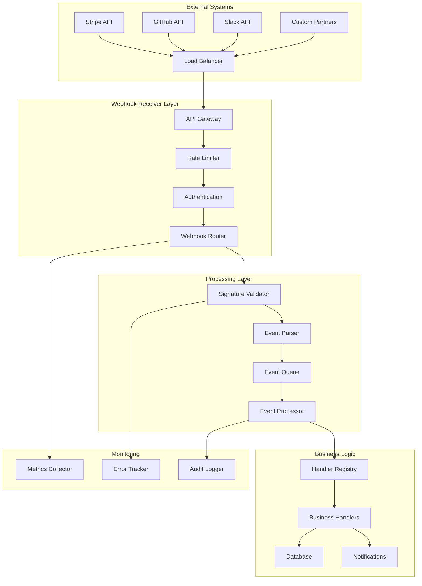
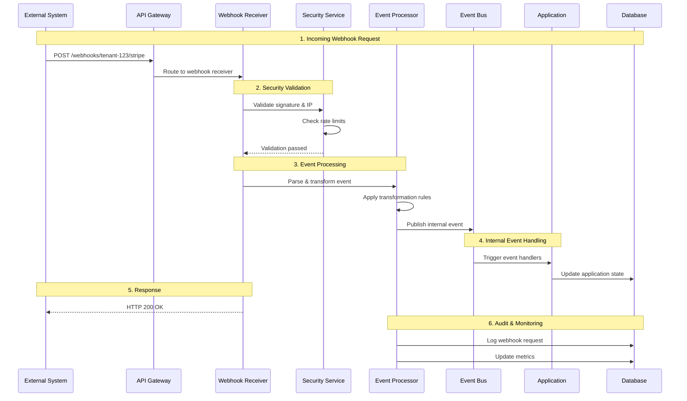

# Webhook Receiver Core Feature Blueprint

## 🎯 **Overview**

Webhook Receiver เป็น core feature ที่ช่วยให้ AegisX Platform สามารถรับ incoming webhooks จาก external systems และแปลงเป็น internal events ได้อย่างปลอดภัยและมีประสิทธิภาพ

## 📋 **Feature Architecture**

### High-Level Architecture



### Webhook Receiver Data Flow



## 🏗️ **Core Feature Options**

### Option 1: Basic Webhook Receiver

```typescript
interface BasicWebhookReceiverOptions {
  // Core configuration
  enabled: boolean;
  endpoint: string; // e.g., '/stripe', '/github'
  method: 'POST' | 'PUT' | 'PATCH';
  
  // Basic security
  secretKey?: string;
  signatureHeader?: string;
  
  // Event mapping
  eventMapping: Record<string, string>;
  
  // Basic settings
  timeoutMs?: number;
  rateLimitPerMinute?: number;
}

// Usage example
const basicReceiver: BasicWebhookReceiverOptions = {
  enabled: true,
  endpoint: '/stripe',
  method: 'POST',
  secretKey: 'whsec_...',
  signatureHeader: 'stripe-signature',
  eventMapping: {
    'payment_intent.succeeded': 'payment.completed',
    'customer.created': 'customer.created'
  },
  timeoutMs: 30000,
  rateLimitPerMinute: 100
};
```

### Option 2: Advanced Webhook Receiver

```typescript
interface AdvancedWebhookReceiverOptions extends BasicWebhookReceiverOptions {
  // Advanced security
  signatureAlgorithm: 'sha256' | 'sha1' | 'md5';
  allowedIPs: string[]; // IP whitelist with CIDR support
  requireHTTPS: boolean;
  
  // Data transformation
  transformationRules: TransformationRule[];
  payloadValidation: JSONSchema;
  
  // Advanced processing
  asyncProcessing: boolean;
  batchProcessing: {
    enabled: boolean;
    batchSize: number;
    flushIntervalMs: number;
  };
  
  // Error handling
  retryPolicy: {
    maxAttempts: number;
    backoffStrategy: 'linear' | 'exponential';
    initialDelayMs: number;
  };
  
  // Monitoring
  enableMetrics: boolean;
  enableAuditLog: boolean;
  alerting: {
    enabled: boolean;
    errorThreshold: number;
    notificationChannels: string[];
  };
}
```

### Option 3: Enterprise Webhook Receiver

```typescript
interface EnterpriseWebhookReceiverOptions extends AdvancedWebhookReceiverOptions {
  // Multi-provider support
  provider: 'stripe' | 'github' | 'slack' | 'salesforce' | 'custom';
  providerConfig: ProviderSpecificConfig;
  
  // High availability
  loadBalancing: {
    enabled: boolean;
    strategy: 'round_robin' | 'least_connections' | 'ip_hash';
  };
  
  // Advanced security
  mTLS: {
    enabled: boolean;
    clientCertPath: string;
    clientKeyPath: string;
  };
  
  // Compliance
  dataRetention: {
    enabled: boolean;
    retentionDays: number;
    archiveToS3: boolean;
  };
  
  // Advanced monitoring
  realTimeMetrics: boolean;
  customMetrics: MetricDefinition[];
  distributedTracing: boolean;
  
  // Integration
  eventBusIntegration: {
    enabled: boolean;
    topics: string[];
    partitionKey?: string;
  };
  
  // Disaster recovery
  backupEndpoints: string[];
  failoverConfig: {
    enabled: boolean;
    healthCheckIntervalMs: number;
    failoverThreshold: number;
  };
}
```

## 🔧 **Provider-Specific Options**

### Stripe Provider

```typescript
interface StripeWebhookOptions {
  provider: 'stripe';
  config: {
    apiVersion: string;
    webhookEndpointSecret: string;
    eventTypes: string[];
    
    defaultEventMapping: {
      'payment_intent.succeeded': 'payment.completed';
      'payment_intent.payment_failed': 'payment.failed';
      'customer.created': 'customer.created';
      'invoice.payment_succeeded': 'invoice.paid';
      'subscription.created': 'subscription.created';
      'subscription.updated': 'subscription.updated';
      'subscription.deleted': 'subscription.cancelled';
    };
    
    defaultTransformations: TransformationRule[];
    
    signatureValidation: {
      header: 'stripe-signature';
      algorithm: 'sha256';
      tolerance: 300;
    };
  };
}
```

### GitHub Provider

```typescript
interface GitHubWebhookOptions {
  provider: 'github';
  config: {
    webhookSecret: string;
    repositoryFilter?: string[];
    
    defaultEventMapping: {
      'push': 'code.pushed';
      'pull_request.opened': 'pull_request.created';
      'pull_request.closed': 'pull_request.closed';
      'issues.opened': 'issue.created';
      'release.published': 'release.published';
    };
    
    defaultTransformations: TransformationRule[];
    
    signatureValidation: {
      header: 'x-hub-signature-256';
      algorithm: 'sha256';
    };
  };
}
```

### Slack Provider

```typescript
interface SlackWebhookOptions {
  provider: 'slack';
  config: {
    signingSecret: string;
    botToken?: string;
    
    defaultEventMapping: {
      'message': 'chat.message_received';
      'app_mention': 'chat.mention_received';
      'reaction_added': 'chat.reaction_added';
      'member_joined_channel': 'chat.member_joined';
    };
    
    defaultTransformations: TransformationRule[];
    
    signatureValidation: {
      header: 'x-slack-signature';
      timestampHeader: 'x-slack-request-timestamp';
      algorithm: 'sha256';
      tolerance: 300;
    };
  };
}
```

## 🎛️ **Configuration Templates**

### Payment Processing Template

```typescript
const paymentWebhookTemplate: WebhookReceiverTemplate = {
  name: 'Payment Processing Webhook',
  description: 'Handle payment events from multiple providers',
  providers: ['stripe', 'paypal', 'square'],
  commonOptions: {
    asyncProcessing: true,
    enableMetrics: true,
    enableAuditLog: true,
    rateLimitPerMinute: 1000,
    timeoutMs: 30000
  },
  eventMappings: {
    'payment_intent.succeeded': 'payment.completed',
    'payment_intent.payment_failed': 'payment.failed',
    'refund.created': 'payment.refunded',
    'PAYMENT.CAPTURE.COMPLETED': 'payment.completed',
    'PAYMENT.CAPTURE.DENIED': 'payment.failed'
  },
  transformationRules: [
    {
      type: 'add_field',
      targetField: 'processedAt',
      value: '{{now}}'
    },
    {
      type: 'conditional',
      condition: 'data.amount > 10000',
      targetField: 'requiresApproval',
      value: true
    }
  ]
};
```

### DevOps Integration Template

```typescript
const devopsWebhookTemplate: WebhookReceiverTemplate = {
  name: 'DevOps Integration Webhook',
  description: 'Handle CI/CD and repository events',
  providers: ['github', 'gitlab', 'jenkins'],
  commonOptions: {
    asyncProcessing: true,
    batchProcessing: {
      enabled: true,
      batchSize: 5,
      flushIntervalMs: 10000
    },
    enableMetrics: true
  },
  eventMappings: {
    'push': 'code.pushed',
    'pull_request.opened': 'code.pull_request_created',
    'workflow_run.completed': 'ci.build_completed',
    'Push Hook': 'code.pushed',
    'Merge Request Hook': 'code.merge_request_created',
    'Pipeline Hook': 'ci.pipeline_completed'
  }
};
```

## 🔐 **Security Options**

### Basic Security

```typescript
interface BasicSecurityOptions {
  signatureValidation: {
    enabled: boolean;
    algorithm: 'sha256' | 'sha1' | 'md5';
    header: string;
    secret: string;
  };
  
  rateLimiting: {
    enabled: boolean;
    requestsPerMinute: number;
    burstLimit: number;
  };
  
  ipFiltering: {
    enabled: boolean;
    allowedIPs: string[];
  };
}
```

### Advanced Security

```typescript
interface AdvancedSecurityOptions extends BasicSecurityOptions {
  ipFiltering: {
    enabled: boolean;
    allowedIPs: string[];
    blockedIPs: string[];
    allowPrivateIPs: boolean;
    geoBlocking: {
      enabled: boolean;
      allowedCountries: string[];
      blockedCountries: string[];
    };
  };
  
  requestValidation: {
    maxPayloadSize: number;
    requiredHeaders: string[];
    payloadSchema?: JSONSchema;
  };
  
  timestampValidation: {
    enabled: boolean;
    toleranceSeconds: number;
    header: string;
  };
  
  ddosProtection: {
    enabled: boolean;
    maxConcurrentRequests: number;
    suspiciousPatternDetection: boolean;
  };
}
```

### Enterprise Security

```typescript
interface EnterpriseSecurityOptions extends AdvancedSecurityOptions {
  mTLS: {
    enabled: boolean;
    clientCertValidation: boolean;
    trustedCAs: string[];
  };
  
  threatDetection: {
    enabled: boolean;
    anomalyDetection: boolean;
    behaviorAnalysis: boolean;
    mlBasedDetection: boolean;
  };
  
  compliance: {
    auditLogging: boolean;
    dataEncryption: boolean;
    piiDetection: boolean;
    gdprCompliance: boolean;
  };
  
  wafIntegration: {
    enabled: boolean;
    provider: 'cloudflare' | 'aws' | 'azure';
    customRules: WAFRule[];
  };
}
```

## 📊 **Monitoring Options**

### Basic Monitoring

```typescript
interface BasicMonitoringOptions {
  metrics: {
    enabled: boolean;
    requestCount: boolean;
    responseTime: boolean;
    errorRate: boolean;
  };
  
  logging: {
    enabled: boolean;
    level: 'error' | 'warn' | 'info' | 'debug';
    destination: 'console' | 'file';
  };
  
  alerting: {
    enabled: boolean;
    errorThreshold: number;
    notificationEmail: string;
  };
}
```

### Advanced Monitoring

```typescript
interface AdvancedMonitoringOptions extends BasicMonitoringOptions {
  metrics: {
    enabled: boolean;
    requestCount: boolean;
    responseTime: boolean;
    errorRate: boolean;
    payloadSize: boolean;
    processingTime: boolean;
    queueDepth: boolean;
    customMetrics: MetricDefinition[];
  };
  
  logging: {
    enabled: boolean;
    level: 'error' | 'warn' | 'info' | 'debug';
    format: 'json' | 'text';
    destinations: LogDestination[];
    sampling: {
      enabled: boolean;
      rate: number;
    };
  };
  
  alerting: {
    enabled: boolean;
    rules: AlertRule[];
    channels: NotificationChannel[];
    escalation: EscalationPolicy;
  };
  
  healthChecks: {
    enabled: boolean;
    endpoint: string;
    intervalSeconds: number;
    timeoutSeconds: number;
  };
}
```

### Enterprise Monitoring

```typescript
interface EnterpriseMonitoringOptions extends AdvancedMonitoringOptions {
  realTimeAnalytics: {
    enabled: boolean;
    dashboard: boolean;
    streaming: boolean;
    retention: {
      realTime: string;
      historical: string;
    };
  };
  
  distributedTracing: {
    enabled: boolean;
    provider: 'jaeger' | 'zipkin' | 'datadog';
    samplingRate: number;
    customTags: Record<string, string>;
  };
  
  apmIntegration: {
    enabled: boolean;
    provider: 'newrelic' | 'datadog' | 'dynatrace';
    customMetrics: boolean;
  };
  
  businessIntelligence: {
    enabled: boolean;
    dataWarehouse: boolean;
    reporting: {
      automated: boolean;
      schedules: ReportSchedule[];
    };
    analytics: {
      predictive: boolean;
      anomalyDetection: boolean;
    };
  };
}
```

## 🚀 **Implementation Examples**

### E-commerce Payment Webhooks

```typescript
const ecommerceWebhookConfig: EnterpriseWebhookReceiverOptions = {
  enabled: true,
  endpoint: '/payments',
  method: 'POST',
  provider: 'stripe',
  
  // Security
  secretKey: process.env.STRIPE_WEBHOOK_SECRET,
  signatureHeader: 'stripe-signature',
  signatureAlgorithm: 'sha256',
  allowedIPs: [
    '3.18.12.63/32',
    '3.130.192.231/32',
    '13.235.14.237/32'
  ],
  requireHTTPS: true,
  
  // Event mapping
  eventMapping: {
    'payment_intent.succeeded': 'order.payment_completed',
    'payment_intent.payment_failed': 'order.payment_failed',
    'refund.created': 'order.refunded',
    'dispute.created': 'order.disputed'
  },
  
  // Data transformation
  transformationRules: [
    {
      type: 'map_field',
      sourceField: 'data.object.id',
      targetField: 'paymentIntentId'
    },
    {
      type: 'map_field',
      sourceField: 'data.object.amount',
      targetField: 'amountCents'
    },
    {
      type: 'add_field',
      targetField: 'provider',
      value: 'stripe'
    },
    {
      type: 'conditional',
      condition: 'data.object.amount > 100000',
      targetField: 'requiresReview',
      value: true
    }
  ],
  
  // Processing
  asyncProcessing: true,
  timeoutMs: 30000,
  rateLimitPerMinute: 1000,
  
  // Monitoring
  enableMetrics: true,
  enableAuditLog: true,
  realTimeMetrics: true,
  
  // Alerting
  alerting: {
    enabled: true,
    errorThreshold: 5,
    notificationChannels: ['slack', 'pagerduty']
  },
  
  // High availability
  loadBalancing: {
    enabled: true,
    strategy: 'least_connections'
  },
  
  // Compliance
  dataRetention: {
    enabled: true,
    retentionDays: 2555, // 7 years for financial data
    archiveToS3: true
  }
};
```

### Healthcare Integration Webhooks

```typescript
const healthcareWebhookConfig: EnterpriseWebhookReceiverOptions = {
  enabled: true,
  endpoint: '/hl7-fhir',
  method: 'POST',
  provider: 'custom',
  
  // Enhanced security for healthcare
  secretKey: process.env.HL7_WEBHOOK_SECRET,
  signatureHeader: 'x-hl7-signature',
  signatureAlgorithm: 'sha256',
  allowedIPs: ['10.0.0.0/8'], // Internal network only
  requireHTTPS: true,
  
  // mTLS for healthcare compliance
  mTLS: {
    enabled: true,
    clientCertPath: '/certs/hl7-client.crt',
    clientKeyPath: '/certs/hl7-client.key'
  },
  
  // Event mapping for HL7 FHIR
  eventMapping: {
    'Patient.create': 'patient.registered',
    'Patient.update': 'patient.updated',
    'Appointment.create': 'appointment.scheduled',
    'Appointment.update': 'appointment.updated',
    'DiagnosticReport.create': 'lab_result.received',
    'Observation.create': 'vital_signs.recorded'
  },
  
  // FHIR-specific transformations
  transformationRules: [
    {
      type: 'map_field',
      sourceField: 'resource.id',
      targetField: 'fhirId'
    },
    {
      type: 'map_field',
      sourceField: 'resource.resourceType',
      targetField: 'resourceType'
    },
    {
      type: 'add_field',
      targetField: 'source',
      value: 'hl7_fhir'
    },
    {
      type: 'conditional',
      condition: 'resource.resourceType === "Patient"',
      targetField: 'isPHI',
      value: true
    }
  ],
  
  // HIPAA compliance
  compliance: {
    auditLogging: true,
    dataEncryption: true,
    piiDetection: true,
    gdprCompliance: false // HIPAA takes precedence
  },
  
  // Extended data retention for healthcare
  dataRetention: {
    enabled: true,
    retentionDays: 2555, // 7 years minimum
    archiveToS3: true
  },
  
  // Enhanced monitoring for critical healthcare data
  realTimeMetrics: true,
  distributedTracing: true,
  
  alerting: {
    enabled: true,
    errorThreshold: 1, // Zero tolerance for healthcare data
    notificationChannels: ['pagerduty', 'sms', 'email']
  }
};
```

## 🎯 **Database Schema**

```sql
-- Incoming webhook configurations
CREATE TABLE incoming_webhook_configs (
  id UUID PRIMARY KEY DEFAULT gen_random_uuid(),
  tenant_id UUID NOT NULL REFERENCES tenants(id),
  name VARCHAR(255) NOT NULL,
  description TEXT,
  
  -- Endpoint configuration
  endpoint VARCHAR(500) NOT NULL,
  method VARCHAR(10) NOT NULL DEFAULT 'POST',
  
  -- Security
  secret_key VARCHAR(255),
  signature_header VARCHAR(100) DEFAULT 'X-Signature',
  signature_algorithm VARCHAR(10) DEFAULT 'sha256',
  allowed_ips TEXT[],
  
  -- Processing configuration
  event_mapping JSONB NOT NULL DEFAULT '{}',
  transformation_rules JSONB DEFAULT '[]',
  
  -- Settings
  enabled BOOLEAN DEFAULT true,
  rate_limit_per_minute INTEGER,
  timeout_ms INTEGER DEFAULT 30000,
  
  -- Metadata
  provider VARCHAR(50) NOT NULL,
  created_at TIMESTAMP DEFAULT NOW(),
  updated_at TIMESTAMP DEFAULT NOW(),
  
  CONSTRAINT unique_endpoint_per_tenant UNIQUE(tenant_id, endpoint)
);

-- Incoming webhook requests log
CREATE TABLE incoming_webhook_requests (
  id UUID PRIMARY KEY DEFAULT gen_random_uuid(),
  webhook_config_id UUID NOT NULL REFERENCES incoming_webhook_configs(id) ON DELETE CASCADE,
  
  -- Request details
  method VARCHAR(10) NOT NULL,
  path VARCHAR(1000) NOT NULL,
  headers JSONB NOT NULL,
  body JSONB,
  raw_body TEXT,
  
  -- Processing status
  status VARCHAR(50) NOT NULL DEFAULT 'received',
  processed_at TIMESTAMP,
  error_message TEXT,
  
  -- Security validation
  signature_valid BOOLEAN NOT NULL,
  ip_address INET NOT NULL,
  
  -- Metadata
  tenant_id UUID NOT NULL REFERENCES tenants(id),
  received_at TIMESTAMP DEFAULT NOW()
);

-- Indexes for performance
CREATE INDEX idx_incoming_webhook_configs_tenant_enabled ON incoming_webhook_configs(tenant_id, enabled);
CREATE INDEX idx_incoming_webhook_configs_endpoint ON incoming_webhook_configs(endpoint);
CREATE INDEX idx_incoming_webhook_requests_config_received ON incoming_webhook_requests(webhook_config_id, received_at);
CREATE INDEX idx_incoming_webhook_requests_status ON incoming_webhook_requests(status);
CREATE INDEX idx_incoming_webhook_requests_tenant_received ON incoming_webhook_requests(tenant_id, received_at);
```

## 📋 **Configuration Schema**

```typescript
interface WebhookReceiverConfigSchema {
  // Basic configuration
  basic: {
    enabled: boolean;
    name: string;
    description?: string;
    endpoint: string;
    method: 'POST' | 'PUT' | 'PATCH';
    provider: 'stripe' | 'github' | 'slack' | 'custom';
  };
  
  // Security configuration
  security: {
    level: 'basic' | 'advanced' | 'enterprise';
    signatureValidation: SignatureValidationConfig;
    ipFiltering: IPFilteringConfig;
    rateLimiting: RateLimitingConfig;
    mTLS?: MTLSConfig;
    compliance?: ComplianceConfig;
  };
  
  // Processing configuration
  processing: {
    eventMapping: Record<string, string>;
    transformationRules: TransformationRule[];
    asyncProcessing: boolean;
    batchProcessing?: BatchProcessingConfig;
    timeoutMs: number;
  };
  
  // Monitoring configuration
  monitoring: {
    level: 'basic' | 'advanced' | 'enterprise';
    metrics: MetricsConfig;
    logging: LoggingConfig;
    alerting: AlertingConfig;
    healthChecks?: HealthCheckConfig;
    tracing?: TracingConfig;
  };
  
  // High availability configuration
  highAvailability?: {
    loadBalancing: LoadBalancingConfig;
    failover: FailoverConfig;
    backupEndpoints: string[];
  };
  
  // Data management
  dataManagement: {
    retention: DataRetentionConfig;
    archiving: ArchivingConfig;
    encryption: EncryptionConfig;
  };
}
```

---

**สรุป:** Webhook Receiver Core Feature Blueprint นี้ให้ options ครบถ้วนตั้งแต่ basic จนถึง enterprise level พร้อมด้วย provider-specific configurations, security levels, monitoring options, และ compliance features สำหรับการรับ webhook requests จาก external systems อย่างปลอดภัยและมีประสิทธิภาพครับ! 🚀

## 🔧 **Implementation Details**

### Core Services Implementation

#### Webhook Receiver Registry Service

```typescript
// libs/modules/webhook-receiver/services/webhook-receiver-registry.service.ts
@Injectable()
export class WebhookReceiverRegistryService {
  constructor(
    private db: TenantQueryBuilder,
    private redis: Redis
  ) {}

  async createReceiver(config: Omit<IncomingWebhookConfig, 'id' | 'createdAt' | 'updatedAt'>): Promise<IncomingWebhookConfig> {
    const receiver = await this.db.table('incoming_webhook_configs').insert({
      id: uuidv4(),
      ...config,
      event_mapping: JSON.stringify(config.eventMapping),
      transformation_rules: JSON.stringify(config.transformationRules || []),
      allowed_ips: config.allowedIPs,
      created_at: new Date(),
      updated_at: new Date()
    }).returning('*');

    // Clear cache
    await this.clearReceiverCache(config.tenantId);

    return this.mapToConfig(receiver[0]);
  }

  async findByEndpoint(endpoint: string, tenantId: string): Promise<IncomingWebhookConfig | null> {
    // Check cache first
    const cacheKey = `webhook-receiver:${tenantId}:${endpoint}`;
    const cached = await this.redis.get(cacheKey);
    
    if (cached) {
      return JSON.parse(cached);
    }

    const config = await this.db.table('incoming_webhook_configs')
      .where('endpoint', endpoint)
      .where('tenant_id', tenantId)
      .where('enabled', true)
      .first();

    if (config) {
      const mapped = this.mapToConfig(config);
      // Cache for 5 minutes
      await this.redis.setex(cacheKey, 300, JSON.stringify(mapped));
      return mapped;
    }

    return null;
  }

  private mapToConfig(row: any): IncomingWebhookConfig {
    return {
      id: row.id,
      tenantId: row.tenant_id,
      name: row.name,
      description: row.description,
      endpoint: row.endpoint,
      method: row.method,
      secretKey: row.secret_key,
      signatureHeader: row.signature_header,
      signatureAlgorithm: row.signature_algorithm,
      allowedIPs: row.allowed_ips,
      eventMapping: JSON.parse(row.event_mapping || '{}'),
      transformationRules: JSON.parse(row.transformation_rules || '[]'),
      enabled: row.enabled,
      rateLimitPerMinute: row.rate_limit_per_minute,
      timeoutMs: row.timeout_ms,
      provider: row.provider,
      createdAt: row.created_at,
      updatedAt: row.updated_at
    };
  }
}
```

#### Security Service

```typescript
// libs/modules/webhook-receiver/services/webhook-security.service.ts
@Injectable()
export class WebhookSecurityService {
  constructor(private redis: Redis) {}

  async validateSignature(
    config: IncomingWebhookConfig,
    body: string,
    signature: string
  ): Promise<boolean> {
    if (!config.secretKey || !signature) {
      return !config.secretKey; // If no secret configured, skip validation
    }

    const expectedSignature = this.generateSignature(
      config.secretKey,
      body,
      config.signatureAlgorithm || 'sha256'
    );

    return this.secureCompare(signature, expectedSignature);
  }

  async validateIPAddress(config: IncomingWebhookConfig, ipAddress: string): Promise<boolean> {
    if (!config.allowedIPs || config.allowedIPs.length === 0) {
      return true; // No IP restriction
    }

    return config.allowedIPs.some(allowedIP => {
      if (allowedIP.includes('/')) {
        // CIDR notation
        return this.isIPInCIDR(ipAddress, allowedIP);
      }
      return ipAddress === allowedIP;
    });
  }

  async checkRateLimit(config: IncomingWebhookConfig, ipAddress: string): Promise<boolean> {
    if (!config.rateLimitPerMinute) {
      return true; // No rate limit
    }

    const key = `webhook-rate-limit:${config.id}:${ipAddress}`;
    const current = await this.redis.incr(key);
    
    if (current === 1) {
      await this.redis.expire(key, 60); // 1 minute window
    }

    return current <= config.rateLimitPerMinute;
  }

  private generateSignature(secret: string, body: string, algorithm: string): string {
    const hmac = crypto.createHmac(algorithm, secret);
    hmac.update(body);
    return `${algorithm}=${hmac.digest('hex')}`;
  }

  private secureCompare(a: string, b: string): boolean {
    if (a.length !== b.length) {
      return false;
    }

    let result = 0;
    for (let i = 0; i < a.length; i++) {
      result |= a.charCodeAt(i) ^ b.charCodeAt(i);
    }

    return result === 0;
  }

  private isIPInCIDR(ip: string, cidr: string): boolean {
    const [network, prefixLength] = cidr.split('/');
    const mask = ~(0xffffffff >>> parseInt(prefixLength));
    
    const ipInt = this.ipToInt(ip);
    const networkInt = this.ipToInt(network);
    
    return (ipInt & mask) === (networkInt & mask);
  }

  private ipToInt(ip: string): number {
    return ip.split('.').reduce((acc, octet) => (acc << 8) + parseInt(octet), 0) >>> 0;
  }
}
```

#### Event Processing Service

```typescript
// libs/modules/webhook-receiver/services/webhook-event-processor.service.ts
@Injectable()
export class WebhookEventProcessorService {
  constructor(
    private eventBus: EventBusService,
    private transformationService: WebhookTransformationService,
    private auditService: AuditService
  ) {}

  async processIncomingWebhook(
    config: IncomingWebhookConfig,
    request: IncomingWebhookRequest
  ): Promise<void> {
    try {
      // Parse the incoming event
      const incomingEvent = this.parseIncomingEvent(request.body, config.provider);
      
      // Map to internal event type
      const internalEventType = this.mapEventType(incomingEvent.type, config.eventMapping);
      
      if (!internalEventType) {
        console.log(`No mapping found for event type: ${incomingEvent.type}`);
        await this.updateRequestStatus(request.id, 'processed', 'Event type not mapped');
        return;
      }

      // Transform the payload
      const transformedPayload = await this.transformationService.transform(
        incomingEvent.data,
        config.transformationRules || []
      );

      // Publish internal event
      await this.eventBus.publish({
        type: internalEventType,
        tenantId: config.tenantId,
        data: {
          ...transformedPayload,
          _webhook: {
            provider: config.provider,
            originalEvent: incomingEvent.type,
            receivedAt: request.receivedAt,
            requestId: request.id
          }
        },
        source: 'webhook',
        timestamp: new Date()
      });

      // Update request status
      await this.updateRequestStatus(request.id, 'processed');

      // Log successful processing
      await this.auditService.log({
        action: 'webhook_processed',
        tenantId: config.tenantId,
        details: {
          webhookId: config.id,
          provider: config.provider,
          eventType: internalEventType,
          requestId: request.id
        }
      });

    } catch (error) {
      console.error(`Failed to process webhook ${request.id}:`, error);
      
      await this.updateRequestStatus(
        request.id, 
        'failed', 
        error instanceof Error ? error.message : 'Unknown error'
      );

      // Log error
      await this.auditService.log({
        action: 'webhook_processing_failed',
        tenantId: config.tenantId,
        details: {
          webhookId: config.id,
          requestId: request.id,
          error: error instanceof Error ? error.message : 'Unknown error'
        }
      });
    }
  }

  private parseIncomingEvent(body: any, provider: string): { type: string; data: any } {
    switch (provider) {
      case 'stripe':
        return {
          type: body.type, // e.g., 'payment_intent.succeeded'
          data: body.data.object
        };
      
      case 'github':
        return {
          type: body.action ? `${body.action}` : 'unknown', // e.g., 'push', 'pull_request'
          data: body
        };
      
      case 'slack':
        return {
          type: body.event?.type || 'message',
          data: body.event || body
        };
      
      default:
        return {
          type: body.event_type || body.type || 'unknown',
          data: body
        };
    }
  }

  private mapEventType(externalType: string, mapping: Record<string, string>): string | null {
    return mapping[externalType] || null;
  }

  private async updateRequestStatus(
    requestId: string, 
    status: string, 
    errorMessage?: string
  ): Promise<void> {
    // Implementation to update request status in database
  }
}
```

### HTTP Endpoint Handler

```typescript
// apps/api/src/routes/webhook-receiver.ts
export async function webhookReceiverRoutes(fastify: FastifyInstance) {
  const registryService = fastify.webhookReceiverRegistry;
  const securityService = fastify.webhookSecurity;
  const processorService = fastify.webhookEventProcessor;

  // Dynamic webhook receiver endpoint
  fastify.all('/webhooks/:tenantId/*', {
    config: {
      rawBody: true // Preserve raw body for signature validation
    }
  }, async (request, reply) => {
    const { tenantId } = request.params;
    const endpoint = `/${request.params['*']}`;
    const ipAddress = request.ip;

    try {
      // Find webhook configuration
      const config = await registryService.findByEndpoint(endpoint, tenantId);
      
      if (!config) {
        reply.code(404).send({ error: 'Webhook endpoint not found' });
        return;
      }

      // Validate method
      if (request.method !== config.method) {
        reply.code(405).send({ error: 'Method not allowed' });
        return;
      }

      // Check rate limit
      const rateLimitOk = await securityService.checkRateLimit(config, ipAddress);
      if (!rateLimitOk) {
        reply.code(429).send({ error: 'Rate limit exceeded' });
        return;
      }

      // Validate IP address
      const ipValid = await securityService.validateIPAddress(config, ipAddress);
      if (!ipValid) {
        reply.code(403).send({ error: 'IP address not allowed' });
        return;
      }

      // Validate signature
      const signature = request.headers[config.signatureHeader?.toLowerCase() || 'x-signature'] as string;
      const signatureValid = await securityService.validateSignature(
        config,
        request.rawBody || JSON.stringify(request.body),
        signature
      );

      if (!signatureValid) {
        reply.code(401).send({ error: 'Invalid signature' });
        return;
      }

      // Create request record
      const webhookRequest: Omit<IncomingWebhookRequest, 'id'> = {
        webhookConfigId: config.id,
        method: request.method,
        path: request.url,
        headers: request.headers as Record<string, string>,
        body: request.body,
        rawBody: request.rawBody || JSON.stringify(request.body),
        status: 'received',
        signatureValid,
        ipAddress,
        tenantId,
        receivedAt: new Date()
      };

      const requestId = await this.saveWebhookRequest(webhookRequest);

      // Process asynchronously
      setImmediate(async () => {
        await processorService.processIncomingWebhook(config, {
          ...webhookRequest,
          id: requestId
        });
      });

      // Return success immediately
      reply.code(200).send({ 
        message: 'Webhook received successfully',
        requestId 
      });

    } catch (error) {
      console.error('Webhook receiver error:', error);
      reply.code(500).send({ error: 'Internal server error' });
    }
  });

  // Admin endpoints for managing webhook receivers
  fastify.get('/admin/webhook-receivers', {
    preHandler: [fastify.authenticate, fastify.requirePermission('webhook:read')]
  }, async (request, reply) => {
    const receivers = await registryService.listReceivers(request.tenant.id);
    return { data: receivers };
  });

  fastify.post('/admin/webhook-receivers', {
    preHandler: [fastify.authenticate, fastify.requirePermission('webhook:create')],
    schema: {
      body: {
        type: 'object',
        required: ['name', 'endpoint', 'provider'],
        properties: {
          name: { type: 'string', minLength: 1, maxLength: 255 },
          description: { type: 'string', maxLength: 1000 },
          endpoint: { type: 'string', pattern: '^/[a-zA-Z0-9/_-]+$' },
          method: { type: 'string', enum: ['POST', 'PUT', 'PATCH'], default: 'POST' },
          provider: { type: 'string', enum: ['stripe', 'github', 'slack', 'custom'] },
          secretKey: { type: 'string' },
          signatureHeader: { type: 'string' },
          signatureAlgorithm: { type: 'string', enum: ['sha256', 'sha1', 'md5'] },
          allowedIPs: { type: 'array', items: { type: 'string' } },
          eventMapping: { type: 'object' },
          transformationRules: { type: 'array' },
          enabled: { type: 'boolean', default: true },
          rateLimitPerMinute: { type: 'integer', minimum: 1 }
        }
      }
    }
  }, async (request, reply) => {
    const receiver = await registryService.createReceiver({
      ...request.body,
      tenantId: request.tenant.id
    });

    return { data: receiver };
  });
}
```

## 📈 **Best Practices**

### Security Best Practices

1. **Always Validate Signatures**
   ```typescript
   // Always verify webhook signatures
   const isValid = await securityService.validateSignature(config, body, signature);
   if (!isValid) {
     throw new Error('Invalid webhook signature');
   }
   ```

2. **Implement Rate Limiting**
   ```typescript
   // Protect against abuse
   const rateLimitConfig = {
     requestsPerMinute: 1000,
     burstLimit: 100,
     windowMs: 60000
   };
   ```

3. **Use HTTPS Only**
   ```typescript
   // Enforce HTTPS for webhook endpoints
   if (config.requireHTTPS && !request.isSecure()) {
     throw new Error('HTTPS required for webhook endpoints');
   }
   ```

4. **IP Whitelisting**
   ```typescript
   // Restrict access by IP address
   const allowedIPs = [
     '192.168.1.0/24',  // Internal network
     '54.187.174.169/32' // Stripe IP
   ];
   ```

### Performance Best Practices

1. **Async Processing**
   ```typescript
   // Process webhooks asynchronously
   setImmediate(async () => {
     await processWebhook(webhookData);
   });
   
   // Return success immediately
   return { status: 'received' };
   ```

2. **Caching**
   ```typescript
   // Cache webhook configurations
   const cacheKey = `webhook-config:${tenantId}:${endpoint}`;
   const cached = await redis.get(cacheKey);
   if (cached) {
     return JSON.parse(cached);
   }
   ```

3. **Batch Processing**
   ```typescript
   // Process multiple webhooks in batches
   const batchConfig = {
     batchSize: 10,
     flushIntervalMs: 5000,
     maxWaitTime: 30000
   };
   ```

### Monitoring Best Practices

1. **Comprehensive Logging**
   ```typescript
   // Log all webhook activities
   await auditService.log({
     action: 'webhook_received',
     tenantId,
     details: {
       endpoint,
       provider,
       eventType,
       processingTime: Date.now() - startTime
     }
   });
   ```

2. **Metrics Collection**
   ```typescript
   // Track important metrics
   metrics.increment('webhook.received', {
     provider,
     endpoint,
     status: 'success'
   });
   
   metrics.histogram('webhook.processing_time', processingTime);
   ```

3. **Health Checks**
   ```typescript
   // Implement health check endpoints
   fastify.get('/health/webhooks', async () => {
     const health = await webhookHealthService.check();
     return {
       status: health.overall,
       checks: health.individual
     };
   });
   ```

### Error Handling Best Practices

1. **Graceful Degradation**
   ```typescript
   try {
     await processWebhook(data);
   } catch (error) {
     // Log error but don't fail the request
     logger.error('Webhook processing failed', { error, data });
     
     // Still return success to prevent retries
     return { status: 'received' };
   }
   ```

2. **Dead Letter Queue**
   ```typescript
   // Move failed webhooks to dead letter queue
   if (retryCount >= maxRetries) {
     await deadLetterQueue.add(webhookData);
     await notifyAdmins('Webhook moved to DLQ', webhookData);
   }
   ```

3. **Circuit Breaker**
   ```typescript
   // Implement circuit breaker for external dependencies
   const circuitBreaker = new CircuitBreaker(externalService.call, {
     timeout: 3000,
     errorThresholdPercentage: 50,
     resetTimeout: 30000
   });
   ```

## 🔍 **Testing Strategy**

### Unit Tests

```typescript
describe('WebhookSecurityService', () => {
  it('should validate Stripe signatures correctly', async () => {
    const service = new WebhookSecurityService();
    const secret = 'whsec_test_secret';
    const body = '{"test": "data"}';
    const signature = 'sha256=expected_signature';
    
    const isValid = await service.validateSignature(
      { secretKey: secret, signatureAlgorithm: 'sha256' },
      body,
      signature
    );
    
    expect(isValid).toBe(true);
  });
  
  it('should validate IP addresses with CIDR', async () => {
    const service = new WebhookSecurityService();
    const config = { allowedIPs: ['192.168.1.0/24'] };
    
    const isValid = await service.validateIPAddress(config, '192.168.1.100');
    expect(isValid).toBe(true);
    
    const isInvalid = await service.validateIPAddress(config, '10.0.0.1');
    expect(isInvalid).toBe(false);
  });
});
```

### Integration Tests

```typescript
describe('Webhook Receiver Integration', () => {
  it('should process Stripe webhook end-to-end', async () => {
    const stripePayload = {
      type: 'payment_intent.succeeded',
      data: {
        object: {
          id: 'pi_test_123',
          amount: 2000,
          currency: 'usd'
        }
      }
    };
    
    const response = await request(app)
      .post('/webhooks/tenant-123/stripe')
      .set('stripe-signature', generateStripeSignature(stripePayload))
      .send(stripePayload)
      .expect(200);
    
    expect(response.body.message).toBe('Webhook received successfully');
    
    // Verify internal event was published
    const events = await eventBus.getEvents('payment.completed');
    expect(events).toHaveLength(1);
    expect(events[0].data.paymentIntentId).toBe('pi_test_123');
  });
});
```

### Load Tests

```typescript
// Load test configuration
const loadTestConfig = {
  target: 'http://localhost:3000',
  phases: [
    { duration: '2m', arrivalRate: 10 },
    { duration: '5m', arrivalRate: 50 },
    { duration: '2m', arrivalRate: 100 }
  ],
  scenarios: [
    {
      name: 'Stripe Webhooks',
      weight: 70,
      flow: [
        {
          post: {
            url: '/webhooks/{{ $randomString() }}/stripe',
            headers: {
              'stripe-signature': '{{ generateStripeSignature() }}'
            },
            json: {
              type: 'payment_intent.succeeded',
              data: { object: { id: '{{ $randomString() }}' } }
            }
          }
        }
      ]
    }
  ]
};
```

---

**สรุป Implementation:** Blueprint นี้ครอบคลุมทุกด้านของ Webhook Receiver ตั้งแต่ core services, security, monitoring, best practices, และ testing strategy เพื่อให้สามารถ implement ได้อย่างมีประสิทธิภาพและปลอดภัยครับ! 🎯 